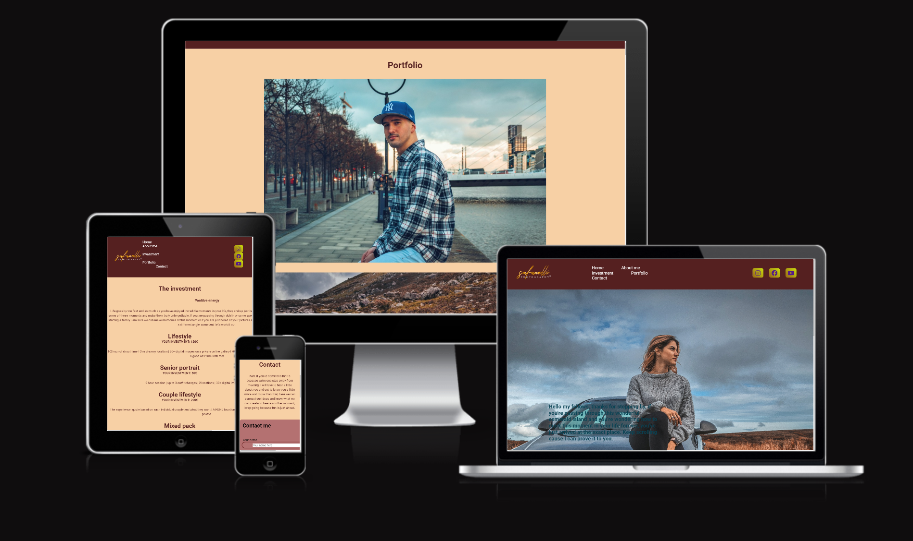
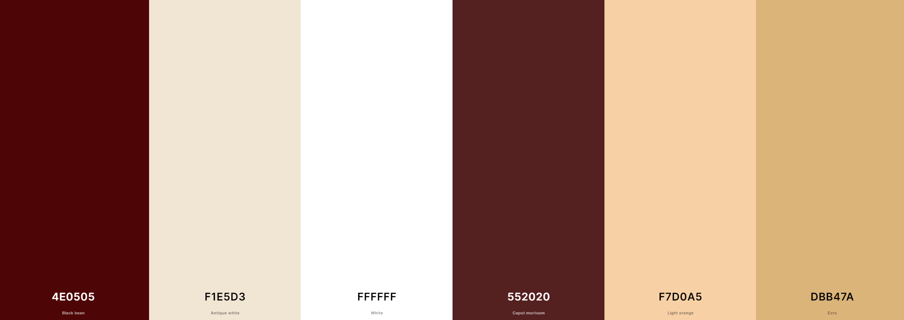
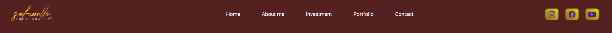
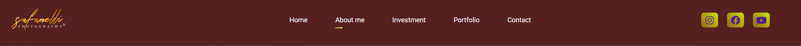

# Safanelli Photographer Coder

 
 Welcome to my website

 With Safanelli Photographer you will understand a little more about how I see photography, how we should consider the special moments that we can freeze forever, so enjoy these moments from time to time remembering with the beautiful images that we freeze

 Safanelli photographer's website will be sought after by people who have some kind of interest in recording moments to remember forever with beautiful memories

 - Here is the link to the final project > [Safanelli Photographer](https://diogosafanelli.github.io/first-project-ci/)

 
 

 ## UX/UI Design
 

 ### Strategy

#### Site owner goals

- The website was created to motivate people to do photo shoots.
- The website have the objective to show a little of the work of the photographer.
- The website will talk about the investment values and a little about the photographer himself.
- The website goal is to attract people's to look at themselves with a more affectionate look and decide to freeze some moments.
- The website should be simple to navigate and easy to read.

#### User stories

- As a user, I want to understand the purpose of the website, so I can know if it's of interest to me.
- As a user, I want to easily navigate the site, so I don't lose enthusiasm for using the site.
- As a user, I want to be able to learn something new, so I fulfill the objective that brought me to the site.
- As a user, I want to have access to all the links, so I can connect if it interests me.
- As a user, I want to see media (photos) related to the main subject, so I can better understand what was explained.

### Scope

- For the Safanelli Photographer website I have planned the following features.
  - Use images and text for more varied content.
  - Use of short texts and longer texts, so the reading doesn't get too tiring.
  - Use technologies and tools that improve site development and performance.

### Structure

- For the Safanelli Photographer website I planned to separate the site into five pages.
  - The home page, which will be the site's introduction page, will contain a little about me, who I am, how I started my career and what I expect from my clients
  - The second page (About me) will be about my self .
  - The third page talks about the investment itself, how it works and the values.
  - The fourth page shows my portfolio so my clients can see about my job so far.
  - The last page is made for the customer to be able to contact me, it has a short form which will make the interaction between the service provider and the customer easier.

### Surface

#### Colour scheme

- The colors chosen for the composition of the site were a combination of 6 colors (white, black bean, Antique white, Caput mortuum, Light orange, Ecru).
- To highlight the header and footer I used two shades of Caput mortuum.
- Here is an image of the color palette used on the website (source: Coolors.io).

#### Typography

- The font were selected from Google Fonts.
  - The font chosen was Roboto 

#### Imagery

- The images selected for the website are intended to complement and assist the content. Each image selected was designed to match the section it was added to.
  - About section image: to create an initial visual impact.
  - All images contained in the portfolio page are my own, photographed and edited by myself.
  - The image on the homepage (Home) is also my own, the image which was photographed in the  wicklow mountains, the model that appears is called Thais Oliveira Safanelli.

## Features

### Existing Features

- Banner 
  - Present on all pages (Home/About me/Investment/Portfolio/Contact) is intended to create a style and identity for the page. The elements in the image refer to the title and theme of the site.

- Navigation Bar
  - Present on all pages to facilitate navigation between them. The font is the same used throughout the website, I tried to keep the style and colors the same as the website.
  - I added a hover effect on the navigation options to make them stand out more when selecting them.
  - Present on all pages as well, has icons to direct users to social network pages. The links open on a new page. It is intended to create a connection with the users.

- Footer
  - Present on all pages as well.
  

### Home page

- About Section
  - This section was created with the intention of introducing the user to the website and explaining what information he/she will have access to.

  

